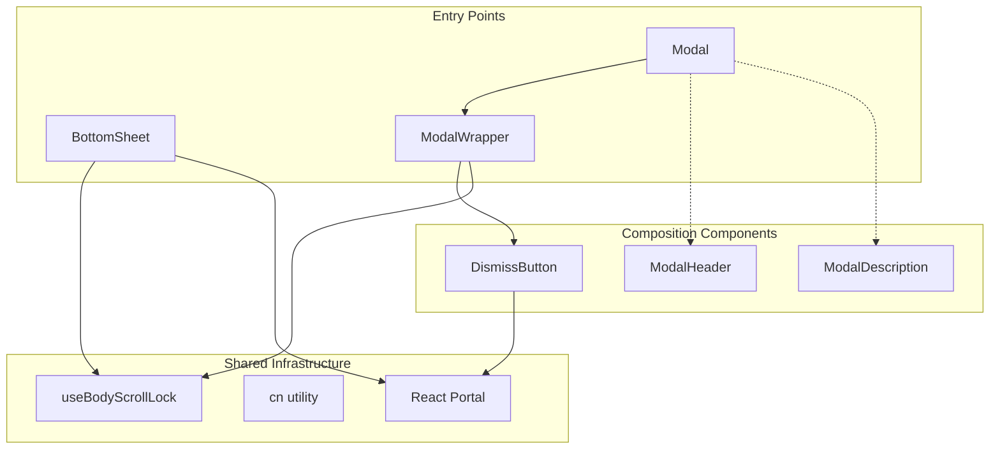
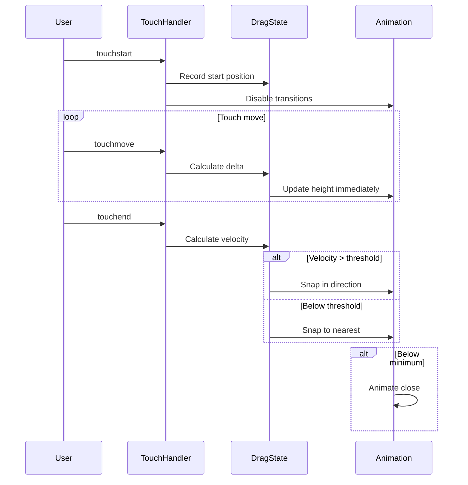

# Architecture

Technical architecture documentation for `@octavian-tocan/react-overlay`.

## Overview

```
@octavian-tocan/react-overlay
├── BottomSheet          # Draggable sheet with snap points
├── Modal                # High-level modal with presets
├── ModalWrapper         # Low-level customizable modal
├── ModalHeader          # Header component
├── ModalDescription     # Description component
├── DismissButton        # Close button with portal support
├── useBodyScrollLock    # Scroll lock hook
└── cn                   # Class name utility
```

## Component Hierarchy



## Package Structure

```
src/
├── index.ts                    # Main entry point, public API
├── types/
│   └── index.ts                # Shared type definitions
├── utils/
│   └── index.ts                # cn utility (clsx + tailwind-merge)
├── hooks/
│   ├── index.ts
│   └── useBodyScrollLock.ts    # Scroll lock with ref-counting
├── bottom-sheet/
│   ├── index.ts                # Feature barrel export
│   ├── BottomSheet.tsx         # Main component
│   ├── types.ts                # BottomSheet-specific types
│   └── constants.ts            # Design tokens
├── modal/
│   ├── index.ts                # Feature barrel export
│   ├── Modal.tsx               # High-level modal
│   ├── ModalWrapper.tsx        # Low-level modal
│   ├── ModalHeader.tsx         # Header component
│   ├── ModalDescription.tsx    # Description component
│   ├── DismissButton.tsx       # Close button
│   └── types.ts                # Modal-specific types
└── styles/
    └── scrollbar.css           # Optional scrollbar styling
```

## Design Decisions

### 1. Dual API Support (open/onDismiss vs isOpen/onClose)

Both Modal components support legacy and new prop names for backward compatibility:

```tsx
// Preferred (new API)
<Modal open={isOpen} onDismiss={handleClose} />

// Deprecated (legacy API)
<Modal isOpen={isOpen} onClose={handleClose} />
```

Resolution happens at runtime:
```tsx
const resolvedOpen = open ?? isOpen ?? false;
const resolvedOnDismiss = onDismiss ?? onClose ?? (() => {});
```

### 2. Portal Rendering

**BottomSheet**: Always renders via `createPortal` to `document.body` for proper stacking.

**DismissButton**: Uses portal with `avoidOverflowClipping={true}` (default) to prevent buttons from being clipped by parent `overflow: hidden`.

### 3. Ref-Counted Body Scroll Lock

Multiple overlays can be open simultaneously. The scroll lock uses ref-counting:

```tsx
let lockCount = 0;

function lockBodyScroll() {
  lockCount += 1;
  if (lockCount > 1) return; // Already locked
  document.body.style.overflow = 'hidden';
}

function unlockBodyScroll() {
  lockCount -= 1;
  if (lockCount > 0) return; // Still other locks active
  document.body.style.overflow = originalOverflow;
}
```

### 4. CSS Styling Strategy

| Component | Styling Approach |
|-----------|------------------|
| BottomSheet | Inline styles (JS object) |
| Modal | Tailwind classes |
| ModalWrapper | Tailwind classes + Framer Motion |
| ModalHeader | Tailwind classes |
| ModalDescription | Tailwind classes |
| DismissButton | Tailwind classes |

**BottomSheet uses inline styles** because:
- Precise pixel calculations for snap points
- Dynamic height animations
- No build-time CSS processing required

**Modals use Tailwind** because:
- Consumer apps typically have Tailwind configured
- Easier className customization
- Size presets map to Tailwind classes

### 5. Scrollbar Styling

WebKit scrollbar pseudo-elements (`::-webkit-scrollbar`) cannot be styled via inline styles. Solution:

1. CSS file with CSS variables for customization
2. `data-ro-scroll` attribute as the selector
3. Consumer must import CSS explicitly (tree-shakeable)

```css
[data-ro-scroll]::-webkit-scrollbar-thumb {
  background: var(--ro-scrollbar-thumb, #0b4f75);
}
```

## Animation Systems

### BottomSheet: CSS Transitions

Uses native CSS transitions for performance:

```tsx
style={{
  transition: isDragging
    ? 'none'
    : `height ${duration}ms cubic-bezier(0.4, 0, 0.2, 1)`
}}
```

- Transitions disabled during drag for immediate feedback
- Spring-like feel via duration calculation based on distance
- Touch event handling with velocity-based snapping

### Modal: Framer Motion

Uses `motion/react` (Framer Motion v11+) for declarative animations:

```tsx
const contentAnimation = {
  initial: { opacity: 0, scale: 0.95, y: 20 },
  animate: { opacity: 1, scale: 1, y: 0 },
  exit: { opacity: 0, scale: 0.95, y: 20 },
};
```

## Drag Gesture Handling (BottomSheet)



### Snap Point Resolution

```tsx
function findSnapPointInDirection(currentHeight, velocity, snapPoints) {
  // Negative velocity = dragging down = want smaller height
  if (velocity < 0) {
    // Find next smaller snap point
    for (let i = sorted.length - 1; i >= 0; i--) {
      if (sorted[i] < currentHeight - 5) return sorted[i];
    }
  }
  // Positive velocity = dragging up = want larger height
  for (let i = 0; i < sorted.length; i++) {
    if (sorted[i] > currentHeight + 5) return sorted[i];
  }
}
```

## Accessibility

### Keyboard Support

| Key | Action |
|-----|--------|
| `Escape` | Close modal/sheet (when `closeOnEscape={true}`) |
| `Tab` | Navigate focusable elements |

### ARIA Attributes

**ModalWrapper:**
```tsx
<div
  role="dialog"
  aria-modal="true"
  aria-labelledby={ariaLabelledBy}
  aria-describedby={ariaDescribedBy}
  aria-label={ariaLabel}
>
```

**BottomSheet:**
```tsx
<button aria-label={title ? `Close ${title}` : 'Close bottom sheet'} />
<div
  data-bottom-sheet-handle
  role="button"
  aria-label={title ? `Drag handle for ${title}` : 'Drag handle'}
/>
```

### Focus Management

- `initialFocusRef` prop for custom initial focus
- `blocking={true}` manages focus trap (BottomSheet)
- Motion's `AnimatePresence` handles exit animations before unmount

## Build Configuration

### tsup.config.ts

```ts
export default defineConfig({
  entry: ['src/index.ts'],
  format: ['esm', 'cjs'],
  dts: true,
  external: ['react', 'react-dom', 'motion', 'clsx', 'tailwind-merge', 'lucide-react'],
  onSuccess: async () => {
    // Copy CSS to dist/styles
    copyFileSync('src/styles/scrollbar.css', 'dist/styles/scrollbar.css');
  },
});
```

### package.json exports

```json
{
  "exports": {
    ".": {
      "types": "./dist/index.d.ts",
      "import": "./dist/index.js",
      "require": "./dist/index.cjs"
    },
    "./styles/scrollbar.css": "./dist/styles/scrollbar.css"
  },
  "sideEffects": ["*.css"]
}
```

## Peer Dependencies

| Package | Version | Usage |
|---------|---------|-------|
| `react` | ^18.0.0 \|\| ^19.0.0 | Core |
| `react-dom` | ^18.0.0 \|\| ^19.0.0 | Portals |
| `motion` | >=11.0.0 | Modal animations |
| `clsx` | ^2.0.0 | Class name utility |
| `tailwind-merge` | ^2.0.0 | Tailwind conflict resolution |
| `lucide-react` | >=0.300.0 | X icon (optional) |

## Testing Strategy

```
src/__tests__/
├── Modal.test.tsx           # Modal component tests
└── useBodyScrollLock.test.ts # Hook unit tests
```

Tests use:
- **Vitest** as test runner
- **@testing-library/react** for component testing
- **jsdom** for DOM environment

## Performance Considerations

1. **Tree-shaking**: All exports are ES modules, unused components are eliminated
2. **CSS Variables**: Scrollbar customization without runtime overhead
3. **Ref-based state**: BottomSheet uses refs for drag state to avoid re-renders
4. **Portal isolation**: Overlays don't trigger parent re-renders
5. **Motion reduce**: Animations respect `prefers-reduced-motion`
